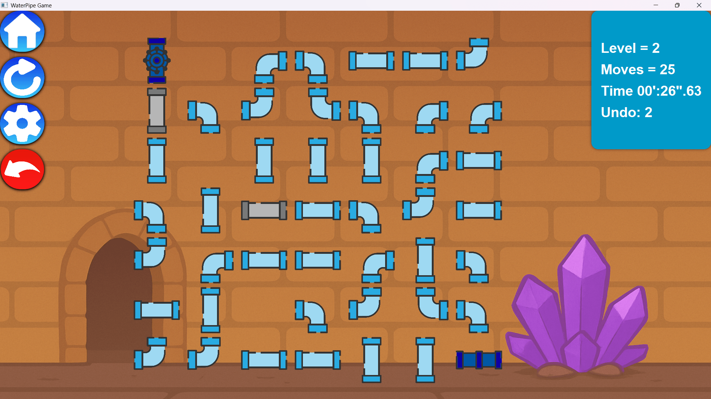
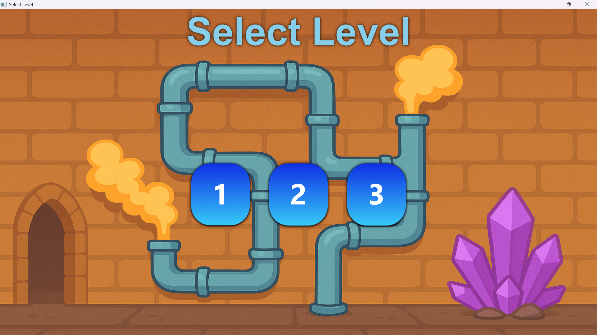

<p align="center">
  
</p>

<h1 align="center">💧 WaterPipe Game</h1>

<p align="center">
A modern JavaFX implementation of the classic Water Pipe Puzzle game.
Rotate the pipes, connect the water source to the destination, and solve increasingly challenging levels.
</p>

---

## ✨ Features

- 🎮 Multiple handcrafted levels
- 🔄 Rotate pipes to complete the pipeline
- ⏱️ Real-time timer
- 📊 Move counter
- ↩️ Undo moves
- 🔁 Restart level
- 🏠 Home menu
- ⚙️ Settings menu
- 🔊 Sound effects
- 🎨 Cartoon-style graphics
- 🚀 Built with JavaFX 21

---

# 📸 Screenshots

## Level Selection

<p align="center">
    
</p>

## Gameplay

<p align="center">
    
</p>

---

# 🎮 How to Play

- Click on a pipe to rotate it.
- Connect the water source to the destination.
- Complete the pipeline before the timer runs out.
- Try to solve each puzzle with the fewest possible moves.

---

# 📥 Download

Download the latest version from the **Releases** page.

➡️ **https://github.com/YOUR_USERNAME/WaterPipeGame/releases/latest**

Simply download the installer and follow the installation steps.

---

# 🛠️ Built With

- Java 21
- JavaFX 21
- Maven
- JPackage

---

# 📂 Project Structure

```
src/
├── main/
│   ├── java/
│   └── resources/
└── test/
```
